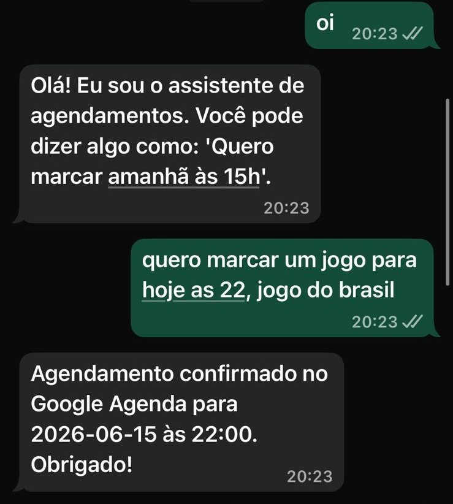
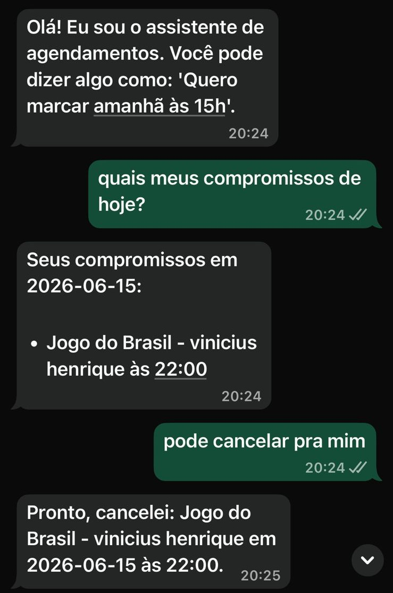

# Agenda WhatsApp Bot


Bot inteligente de agendamento via WhatsApp desenvolvido em Python. O sistema interpreta mensagens em linguagem natural com IA, cria e cancela compromissos no Google Agenda, verifica conflitos de horário e mantém um histórico local utilizando SQLite.

## Demonstração

### Agendamento automático



O usuário envia uma mensagem em linguagem natural pelo WhatsApp e o bot identifica data, horário e descrição do compromisso, criando automaticamente o evento no Google Agenda.

### Cancelamento de compromisso



O bot também é capaz de localizar e cancelar compromissos criados anteriormente apenas através de comandos em linguagem natural enviados pelo WhatsApp.

## Funcionalidades

* Interpretação de mensagens com IA usando Groq
* Criação automática de eventos no Google Agenda
* Cancelamento de compromissos
* Consulta de compromissos criados pelo bot
* Verificação de conflitos de horários
* Memória de conversa com SQLite
* Histórico local dos eventos criados
* Integração com WhatsApp via Twilio ou WhatsApp Cloud API
* Servidor Flask para recebimento de webhooks
* Suporte a testes locais com ngrok

## Visão geral

Este projeto foi criado para automatizar o processo de agendamento por WhatsApp.

Exemplos de mensagens aceitas:

```text
Quero marcar amanhã às 15h
```

```text
Cancelar meu compromisso de amanhã às 15h
```

```text
Quais são meus compromissos?
```

O bot interpreta a mensagem, consulta o Google Agenda, executa a ação solicitada e responde automaticamente ao usuário.

## Tecnologias utilizadas

* Python
* Flask
* Groq API
* Google Calendar API
* SQLite
* Twilio WhatsApp Sandbox
* WhatsApp Cloud API da Meta
* ngrok
* python-dotenv
* dateparser

## Estrutura do projeto

```text
agenda-whatsapp-bot/
├── ai.py
├── app.py
├── database.py
├── google_calendar.py
├── requirements.txt
├── .env.example
├── .gitignore
├── LICENSE
├── README.md
└── screenshots/
    ├── agendamento.png
    └── cancelamento.png
```

## Status do projeto

🚧 Em desenvolvimento

### Implementado

- ✅ Integração com IA (Groq)
- ✅ Criação de eventos no Google Agenda
- ✅ Cancelamento de eventos
- ✅ Consulta de compromissos
- ✅ Memória local com SQLite
- ✅ Webhook com Flask
- ✅ Testes via WhatsApp (Twilio)

### Próximas melhorias

- 🔄 Migração completa para WhatsApp Cloud API
- 🔔 Envio automático de lembretes
- 📋 Templates aprovados pela Meta
- 🌐 Painel administrativo web
- 🧠 Melhor interpretação de linguagem natural
- ☁️ Deploy em produção
- 👤 Sistema de autenticação

## Licença

Este projeto está licenciado sob a licença MIT. Consulte o arquivo LICENSE para mais informações.